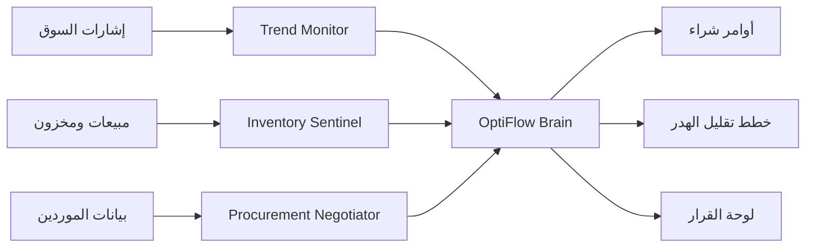

# معمارية OptiFlow AI

## تدفق القرار

1. يختار المستخدم النشاط: مطعم، بقالة، أو مصنع أسمدة الخرج.
2. يحسب Trend Monitor معامل ارتفاع الطلب.
3. يحسب Inventory Sentinel تغطية كل صنف بالأيام.
4. يختار Procurement Negotiator المورد الأفضل لكل صنف حرج.
5. يطبق Orchestration Core قيود الميزانية وسعة التخزين.
6. تعرض الواجهة القرار التنفيذي، المخاطر، أوامر الشراء، وتوقع الطلب.
7. يمكن للمستخدم إضافة صنف جديد، ويحفظ الصنف في المتصفح المحلي.

## نموذج الموردين

يعتمد اختيار المورد على:

- الموثوقية.
- مؤشر السعر.
- زمن الوصول بعد تأثير التعطل.
- المسافة.
- الاستدامة.

## نموذج المخاطر

الصنف يصبح حرجا عندما تكون تغطيته أقل من زمن الوصول المتوقع مضافا له هامش أمان، أو عندما ينخفض عن نقطة إعادة الطلب. الصنف يصبح تحت المراقبة عند قربه من مستوى الخطر أو عند وجود هدر متوقع.
